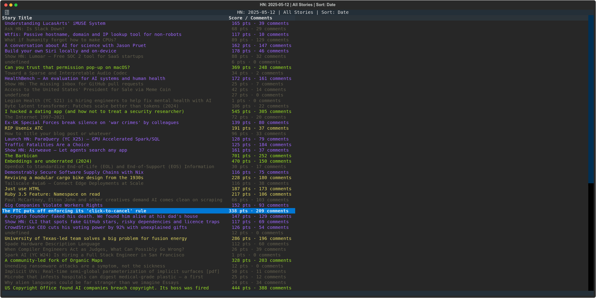

# hckrnews - Hacker News CLI Viewer

A command line tool to display the top stories from Hacker News using the API provided by hckrnews.com.



## License

This project is licensed under the [MIT License](LICENSE.md) - see the LICENSE.md file for details.

## Features

- View top stories from Hacker News in your terminal
- Color-coded titles based on story score:
  - Green: Top 10 stories
  - Yellow: Stories ranked 11-20
  - Purple: Stories in the top 50% (excluding top 20)
  - Grey: Other stories
- 2-column layout showing titles and points/comments
- Various filtering options:
  - Top 10 stories
  - Top 20 stories
  - Top 50% of stories
  - All stories
- Navigation between different days
- Multiple sorting options:
  - By points
  - By comments
  - By submission date
- Keyboard shortcuts for all actions

## Installation

### From PyPI (Recommended)

Install directly from PyPI:

```bash
pip install hckrnews
```

Or if you're using uv:

```bash
uv pip install hckrnews
```

### Development Installation

Clone this repository and install in development mode:

```bash
cd hckrnews
pip install -e .
```

Or if you're using uv:

```bash
cd hckrnews
uv pip install -e .
```

## Usage

Simply run the `hckrnews` command to start the application:

```bash
hckrnews
```

### Keyboard Shortcuts

- `j` - Previous day (earlier)
- `k` - Next day (later)
- `l` - Open comments page in browser
- `space` - Open story URL in browser
- `1` - Show top 10 stories
- `2` - Show top 20 stories
- `3` - Show top 50% stories
- `4` - Show all stories
- `p` - Sort by points
- `c` - Sort by comments
- `d` - Sort by date
- `r` - Refresh current view
- `q` - Quit the application
- Arrow keys - Navigate between stories

## Data Source

Data is fetched from the hckrnews.com API:
`https://hckrnews.com/data/YYYYMMDD.js`

## Development Tools

### Version Bumping

The project includes a version bumping script that helps maintain consistent versioning across the codebase. It updates:

- Version in pyproject.toml
- User-Agent version in API requests
- Git commits (optional)
- Git tags (optional)

Usage:

```bash
# Increment patch version (0.1.0 -> 0.1.1)
python bump_version.py patch

# Increment minor version (0.1.0 -> 0.2.0)
python bump_version.py minor

# Increment major version (0.1.0 -> 1.0.0)
python bump_version.py major

# Set specific version
python bump_version.py --set 0.2.0

# Increment version and create git commit
python bump_version.py patch --commit

# Increment version, create commit and git tag
python bump_version.py patch --tag
```

When using the `--tag` option, the script automatically creates a commit with message "chore: version bump to x.y.z" before tagging.
