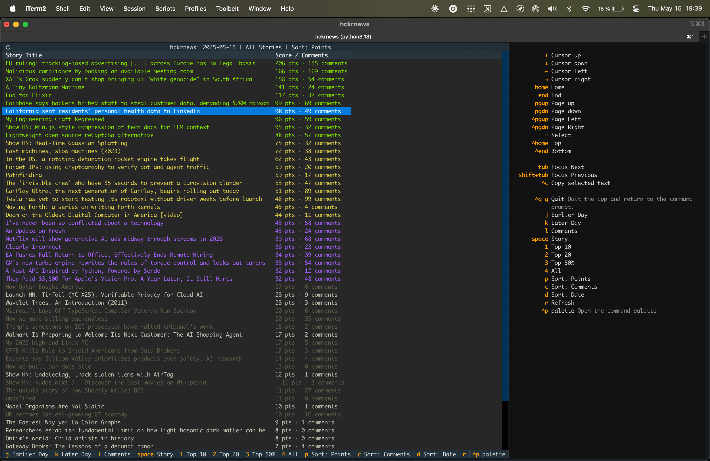

# HN - Hacker News CLI Viewer

A command line tool to display the top stories from Hacker News using the API provided by hckrnews.com.



## Features

- View top stories from Hacker News in your terminal
- Color-coded titles based on story score
- 2-column layout showing titles and points/comments
- Various filtering options (top 10, top 20, etc.)
- Navigation between different days
- Keyboard shortcuts for all actions

## Installation

Clone this repository and install with pip:

```bash
cd hn
pip install -e .
```

Or if you're using uv:

```bash
cd hn
uv pip install -e .
```

## Usage

Simply run the `hn` command to start the application:

```bash
hn
```

### Keyboard Shortcuts

- `q` - Quit the application
- `r` - Refresh current view
- `j` - Previous day
- `k` - Next day
- `space` - Open story URL in browser
- `l` - Open comments page in browser
- `1` - Show top 10 stories
- `2` - Show top 20 stories
- `3` - Show top 50% stories
- `4` - Show all stories
- `p` - Sort by points
- `c` - Sort by comments
- `d` - Sort by date

### Interaction

- Select a story title (first column) to open the story URL in your browser
- Select the points/comments cell (second column) to open the comments page for that story
- Use up/down arrow keys to navigate between stories

## Data Source

Data is fetched from the hckrnews.com API:
`https://hckrnews.com/data/YYYYMMDD.js`